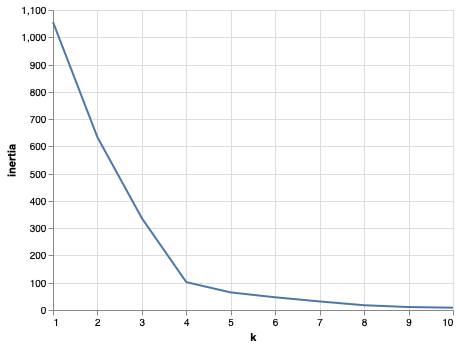

# The Power of the Cloud and Unsupervised Learning


## Table of Contents
<details> 
<ol>
<li>
Crypto Clustering Overview
</li>
<li>
Data Preprocessing
</li>
<li>
Reducing Data Dimentions Using PCA
</li>
<li>
Clustering Cryptocurrencies Using K-Means
</li>
<li>
Visualizing Results
</li>
<li>
Optional Challenge
</li>
</ol>
</details>

**File:** [Clustering Crypto](./ClusteringCrypto/crypto_clustering.ipynb)
**File:** [Optional Challenge](./ClusteringCrypto/crypto_clustering_sm.ipynb)

## Crypto Clustering Overview

In this assignment I run the k-Means algorithm and a Principal Component Analysis (PCA) to cluster cryptocurrencies. 

- Assuming I am a Senior Manager at the Advisory Services team on a [Big Four firm](https://en.wikipedia.org/wiki/Big_Four_accounting_firms).
- One of my most important clients, a prominent investment bank, is interested in offering a new cryptocurrencies investment portfolio for its customers, however, they are lost in the immense universe of cryptocurrencies. 
- They ask me to help them make sense of it all by generating a report of what cryptocurrencies are available on the trading market and how they can be grouped using classification.
- I will put my new unsupervivsed learning and Amazon SageMaker skills into action by clustering cryptocurrencies and creating plots to present my results.

- I am asked to accomplish the following main tasks:

- **[Data Preprocessing](#data-processing):** Prepare data for dimension reduction with PCA and clustering using K-Means.

- **[Reducing Data Dimensions Using PCA](#reducing-data-dimentions-using-pca):** Reduce data dimension using the `PCA` algorithm from `sklearn`.

- **[Clustering Cryptocurrencies Using K-Means](#clustering-cryptocurrencies-using-k-means):** Predict clusters using the cryptocurrencies data using the `KMeans` algorithm from `sklearn`.

- **[Visualizing Results](#visualizing-results):** Create some plots and data tables to present my results.

- **[Optional Challenge](#optional-challenge):** Deploy my notebook to Amazon SageMaker.

## Data Processing

- [x] Using the following `requests` library, retreive the necessary data from the following API endpoint from _CryptoCompare_ - `https://min-api.cryptocompare.com/data/all/coinlist`. **HINT:** I will need to use the 'Data' key from the json response, then transpose the DataFrame. Name my DataFrame `crypto_df`.

```python
# Use the following endpoint to fetch json data
url = "https://min-api.cryptocompare.com/data/all/coinlist"
response = requests.get(url).json()

# Create a DataFrame 
crypto_df = pd.DataFrame(response["Data"]).T
```

- With the data loaded into a Pandas DataFrame, continue with the following data preprocessing tasks.

- [x] Keep only the necessary columns: 'CoinName','Algorithm','IsTrading','ProofType','TotalCoinsMined','CirculatingSupply'

```python
# Keep only necessary columns
crypto_df = crypto_df[['CoinName','Algorithm','IsTrading','ProofType','TotalCoinsMined','CirculatingSupply']]
```

- [x] Keep only the cryptocurrencies that are trading.

```python
# Keep only cryptocurrencies that are trading
crypto_df = crypto_df[crypto_df["IsTrading"] == True]
```

- [x] Keep only the cryptocurrencies with a working algorithm.

```python
crypto_df = crypto_df[crypto_df["Algorithm"] != "N/A"]
```

- [x] Remove the `IsTrading` column.

```python
crypto_df = crypto_df.drop(columns = ["IsTrading"])
```

- [x] Remove all cryptocurrencies with at least one null value.

```python
crypto_df = crypto_df.dropna()
```

- [x] Remove all cryptocurrencies that have no coins mined.

```python
crypto_df = crypto_df[crypto_df["TotalCoinsMined"] > 0]
```

- [x] Drop all rows where there are 'N/A' text values.

```python
crypto_df = crypto_df[crypto_df.iloc[:] != "N/A"].dropna()
```

- [x] Store the names of all cryptocurrencies in a DataFrame named `coins_name`, use the `crypto_df.index` as the index for this new DataFrame.

```python
coins_name = crypto_df.index
```

- [x] Remove the `CoinName` column.

```python
crypto_df = crypto_df.drop("CoinName", axis=1)
```

- [x] Create dummy variables for all the text features, and store the resulting data in a DataFrame named `X`.

```python
X = pd.get_dummies(data = crypto_df, columns = ["Algorithm", "ProofType"])
```

- [x] Use the [`StandardScaler` from `sklearn`](https://scikit-learn.org/stable/modules/generated/sklearn.preprocessing.StandardScaler.html) to standardize all the data of the `X` DataFrame. Remember, this is important prior to using PCA and K-Means algorithms.

```python
X = StandardScaler().fit_transform(X)
```

## Reducing Data Dimentions Using PCA

- [x] Use the [`PCA` algorithm from `sklearn`](https://scikit-learn.org/stable/modules/generated/sklearn.decomposition.PCA.html) to reduce the dimensions of the `X` DataFrame down to three principal components.

```python
pca = PCA(n_components=3)
crypto_pca = pca.fit_transform(X)
```

- [x] Once I have reduced the data dimensions, create a DataFrame named `pcs_df` using as columns names `"PC 1", "PC 2"` and `"PC 3"`; use the `crypto_df.index` as the index for this new DataFrame.

```python
pcs_df = pd.DataFrame(
    crypto_pca,
    columns = ["PC 1", "PC 2", "PC 3"],
    index = coins_name
)
pcs_df.head(10)
```

## Clustering Cryptocurrencies Using k-means

- [x] Create an Elbow Curve to find the best value for `k` using the `pcs_df` DataFrame.

```python
inertia = []
k = list(range(1, 11))

# Calculate the inertia for the range of k values
for i in k:
    k_model = KMeans(n_clusters=i, random_state=1)
    k_model.fit(pcs_df)
    inertia.append(k_model.inertia_)

# Create the Elbow Curve using hvPlot
elbow_data = {"k": k, "inertia": inertia}
df_elbow = pd.DataFrame(elbow_data)

# Create Elbow plot
df_elbow.hvplot.line(
    x="k", 
    y="inertia", 
    title="Elbow Curve", 
    xticks=k
)
```


- [x] Once I define the best value for `k`, run the `Kmeans` algorithm to predict the `k` clusters for the cryptocurrencies data. Use the `pcs_df` to run the `KMeans` algorithm.

```python
# Initialize the K-Means model
model = KMeans(n_clusters = 10, random_state=0)

# Fit the model
model.fit(pcs_df)

# Predict clusters
k_10 = model.predict(pcs_df)
```

- [x] Create a new DataFrame named `clustered_df`, that includes the following columns `"Algorithm", "ProofType", "TotalCoinsMined", "TotalCoinSupply", "PC 1", "PC 2", "PC 3", "CoinName", "Class"`. I should maintain the index of the `crypto_df` DataFrames as is shown bellow.

```python
clustered_df = pd.concat([crypto_df, pcs_df], axis=1)
clustered_df["Class"] = k_10
clustered_df["CoinName"] = coins_name
clustered_df.head(20)
```

## Visualizing Results

- In this section, I will create some data visualization to present the final results. 
- [x] Create a scatter plot using `hvplot.scatter`, to present the clustered data about cryptocurrencies having `x="TotalCoinsMined"` and `y="TotalCoinSupply"` to contrast the number of available coins versus the total number of mined coins. Use the `hover_cols=["CoinName"]` parameter to include the cryptocurrency name on each data point.

```python
# Plot Scatter plot
clustered_df.hvplot.scatter(
    x= "TotalCoinsMined", 
    y= "CirculatingSupply",
    hover_cols=["CoinName"]
)
```


- [x] Use `hvplot.table` to create a data table with all the current tradable cryptocurrencies. The table should have the following columns: `"CoinName", "Algorithm", "ProofType", "CirculatingSupply", "TotalCoinsMined", "Class"`

```python
clustered_df.hvplot.table(columns=["CoinName", "Algorithm", "ProofType", "CirculatingSupply", "TotalCoinsMined", "Class"], sortable=True, selectable=True)
```


## Optional Challenge

- For the challenge section, I have to upload my Jupyter notebook to Amazon SageMaker and deploy it.

- The `hvplot` library is not included in the built-in anaconda environments, so for this challenge section, I should use the `altair` library instead.

- [x] Upload my Jupyter notebook and rename it as `crypto_clustering_sm.ipynb`

- [x] Select the `conda_python3` environment.
- [x] Install the `altair` library by running the following code before the initial imports.
   ```python
   !pip install -U altair
   ```
- [x] Use the `altair` scatter plot to create the Elbow Curve.

```python
inertia = []
k = list(range(1, 11))

# Calculate the inertia for the range of k values
for i in k:
    k_model = KMeans(n_clusters=i, random_state=1)
    k_model.fit(pcs_df)
    inertia.append(k_model.inertia_)

# Create the Elbow Curve using altair
elbow_data = {"k": k, "inertia": inertia}
df_elbow = pd.DataFrame(elbow_data)

# Create Elbow plot
alt.Chart(df_elbow).mark_line().encode(
    x="k", 
    y="inertia"
)
```



- [x] Use the `altair` scatter plot to visualize the clusters. Since this is a 2D-Scatter, use `x="PC 1"` and `y="PC 2"` for the axes, and add the following columns as tool tips: `"CoinName", "Algorithm", "TotalCoinsMined", "TotalCoinSupply"`.

```python
# Plot the scatter with x="PC 1" and y="PC 2"
# Plot the clusters
alt.Chart(clustered_df).mark_circle(size=60).encode(
    x="PC 1",
    y="PC 2",
    color='Class',
    tooltip=['CoinName', 'Algorithm', 'TotalCoinsMined', 'CirculatingSupply']
).interactive()
```


- [x] Show the table of current tradable cryptocurrencies using the `display()` command.
```python
display(clustered_df)
```
- [x] Remove all `hvplot` references from the code.